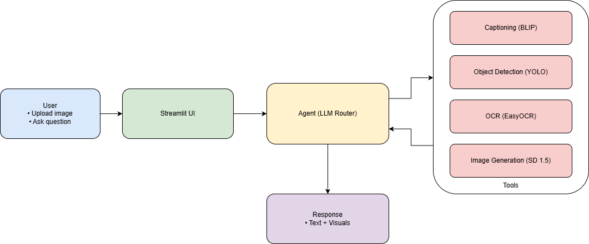
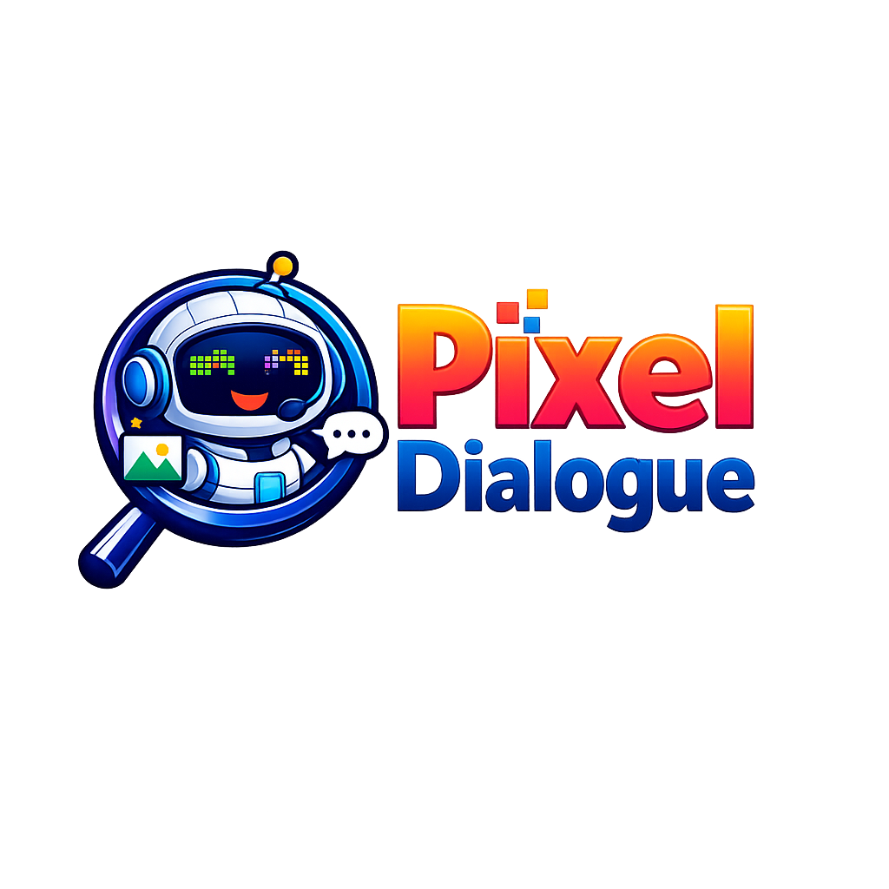

<!-- Banner -->
<p align="center">
  
</p>

<h1 align="center">
  
</h1>


<h1 align="center">✨ Pixel Dialogue</h1>
<p align="center"><em>Chat with your images — Caption • Detect • OCR • Generate</em></p>

<p align="center">
  <!-- Badges -->
  <a href="https://www.python.org/"></a>
  <a href="https://streamlit.io/"></a>
  <a href="https://python.langchain.com/"></a>
  
  
</p>

---

<p align="center">
  
</p>

## 🧠 What is Pixel Dialogue?
**Pixel Dialogue** is your images' conversational companion. Upload a picture and ask anything:
- “What’s in this image?”
- “List objects with bounding boxes and confidence.”
- “Extract the text in this poster.”
- “Generate a futuristic version of this scene.”

Under the hood, a LangChain agent chooses the right tool (BLIP, YOLO, EasyOCR, Stable Diffusion) and an LLM to deliver fast, grounded answers.

---


## 🚀 Features
- 🖼️ **Image Captioning** — BLIP generates rich descriptions.
- 🔍 **Object Detection** — YOLO finds objects + bounding boxes + confidence.
- 🧾 **Text Extraction (OCR)** — EasyOCR pulls text from images.
- 🎨 **AI Image Generation** — Stable Diffusion v1.5 renders from prompts.
- 🧠 **Conversational Agent** — LangChain + LLMs (Llama/Gemini) route tasks to the right tool.
- ♻️ **One‑click Reset** — Clears `.tmp/.gen` and **rebuilds file uploader** via dynamic keys for a fresh UI.

## 🛠️ Tech Stack
**Streamlit** · **LangChain** · **Groq/Google LLMs** · **YOLO** · **BLIP** · **EasyOCR** · **Stable Diffusion** · **Python 3.10+**

---

## 📥 Installation
```bash
# 1) Clone
git clone https://github.com/OnkarUpadhyay/PIXEL-DIALOGUE.git
cd Pixel_Dialogue

# 2) Virtual environment
python -m venv .venv
# Windows
.venv\Scripts\Activate.ps1
# macOS/Linux
# source .venv/bin/activate

# 3) Install
pip install -r requirements.txt

# 4) Environment (create .env)
# GROQ_API_KEY=...
# GOOGLE_API_KEY=...
# TAVILY_API_KEY=...

# 5) Run
streamlit run main.py
```

> **Note:** The app uses ephemeral workspaces: `.tmp/` for uploaded files and `.gen/` for generated images. The **Reset** button clears them and uses a **dynamic uploader key** to fully reset the UI.

---


## 🧭 Architecture
<p align="center">
  
</p>

**Flow:** Browser → Streamlit (UI + Agent) → LangChain (Groq/Gemini) → Tools (BLIP/YOLO/EasyOCR/SD) → Workspaces (`.tmp`, `.gen`) → Answer.

---

## 📁 Project Structure
```
Pixel_Dialogue/
├─ main.py               # Streamlit UI + agent orchestration
├─ tools.py              # Tools: caption, detect, OCR, generate, search
├─ assets                # UI images (logo, banner, icons)
├─ .tmp/                 # ephemeral uploads (gitignored)
├─ .gen/                 # generated images (gitignored)
├─ requirements.txt
├─ .gitignore
└─ README.md
```

---

## 🙌 Contributing
PRs are welcome: new tools, UI polish, GPU tips, or CI workflows.

<p align="center">
  
</p>

